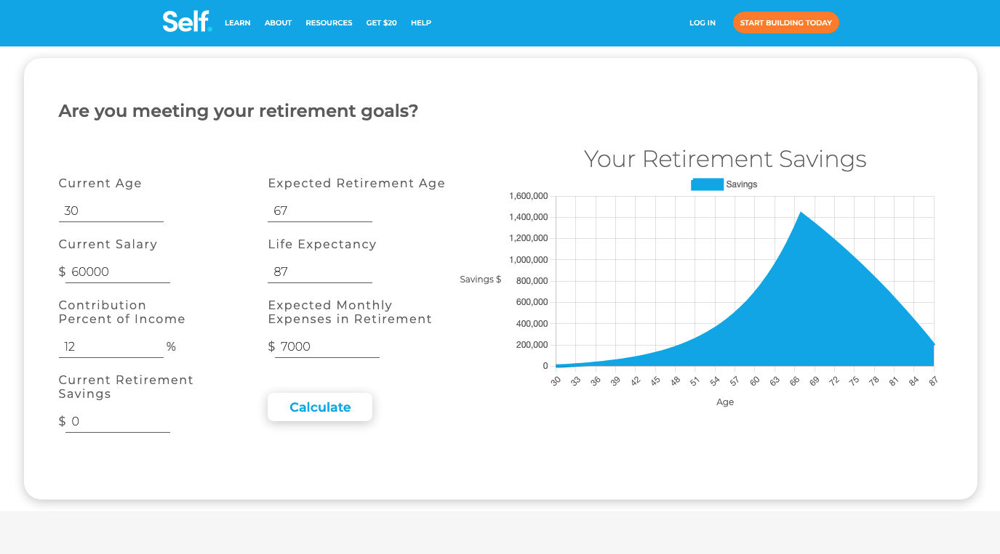

# Industry Project - Retirement Calculator

## Objective

The objective of this project was to create a retirement calculator application for Self Financial Inc., a Fintech company based out of Austin TX that specializes in providing credit building tools and financial services to its customers.

#### Technical Requirements:

- Take in at least five user inputs
- Display retirement savings with a graph visualization
- Utilize version control to merge team member branches
- Design needed to fit client's existing style

## Functionality

#### The Input Form:

The values provided by the user in the input sets the values of key variables that are used to calculate the user's retirement savings and output those savings on the chart. The form requires the following user inpits:

- Current Age
- Current Salary
- Contribution Percent of Income
- Current Retirement savings
- Expected Retirement Age
- Life Expectancy
- Expected Monthly Expenses in Retirement

#### The Chart

When the user presses the "Calculate" button, the provided inputs are assigned to variables which are passed to a javascript function. For every year, a data point is added to the graph which represents the user's projected retirement savings at that time.

## Included Technologies

- React.js
- Chart.js
- SCSS
